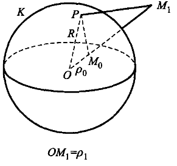
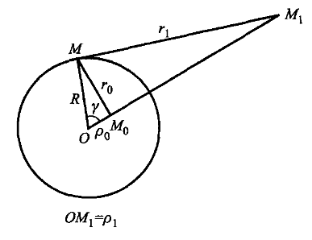

# 调和方程

## 调和方程和定解条件

* 拉普拉斯方程：$\Delta u \equiv \frac{\partial^{2} u}{\partial x^{2}}+\frac{\partial^{2} u}{\partial y^{2}}+\frac{\partial^{2} u}{\partial z^{2}}=0$
* 泊松方程：$\Delta u \equiv \frac{\partial^{2} u}{\partial x^{2}}+\frac{\partial^{2} u}{\partial y^{2}}+\frac{\partial^{2} u}{\partial z^{2}}=f(x, y, z)$
* 狄利克雷问题：$\left.u\right|_{\Gamma}=g$
* 诺伊曼问题：$\left.\frac{\partial u}{\partial n}\right|_{\Gamma}=g$
* 三维外问题：$\lim _{r \rightarrow \infty} u(x, y, z)=0 \quad\left(r=\sqrt{x^{2}+y^{2}+z^{2}}\right)$
* 二维外问题：$|u(x, y)|<M\quad(r=\sqrt{x^{2}+y^{2}}>K)$

## 变分原理

* 总位能：$J(u)=\iint_{\Omega}\left\{\frac{1}{2}\left[\left(\frac{\partial u}{\partial x}\right)^{2}+\left(\frac{\partial u}{\partial y}\right)^{2}\right]-f u\right\} \mathrm{d} x \mathrm{~d} y$
* 变分原理：如果满足$J(u)=\min _{v \in V_{0}} J(v)$的函数$u\in V_0=\left\{v \in C^{2}(\Omega) \cap C^{1}(\bar{\Omega}),\left.v\right|_{\Gamma}=0\right\}$存在，它必满足$\left\{\begin{array}{l}-\Delta u=f, \\\left.u\right|_{\Gamma}=0\end{array}\right.$。反之，若$u$是定解问题的解，则$u$必为变分问题的解。

## 格林公式及其应用

* 格林公式：$\iiint_{\Omega}\left(\frac{\partial P}{\partial x}+\frac{\partial Q}{\partial y}+\frac{\partial R}{\partial z}\right) d \Omega=\iint_{\Gamma}(P \cos (\boldsymbol{n}, x)+Q \cos (\boldsymbol{n}, y)+R \cos (\boldsymbol{n}, z)) \mathrm{d} S$
* 格林第二公式：$\iiint_{\Omega}(u \Delta v-v \Delta u) \mathrm{d} \Omega=\iint_{\Gamma}\left(u \cdot \frac{\partial v}{\partial n}-v \frac{\partial u}{\partial n}\right) \mathrm{d} S$
* 三维拉普拉斯方程的基本解：$v=\frac{1}{r_{M_{0} M}}=\frac{1}{\sqrt{\left(x-x_{0}\right)^{2}+\left(y-y_{0}\right)^{2}+\left(z-z_{0}\right)^{2}}}$
* 三维拉普拉斯方程的基本积分公式：$u\left(M_{0}\right)=-\frac{1}{4 \pi} \iint_{\Gamma}\left[u(M) \frac{\partial}{\partial n}\left(\frac{1}{r_{M_{0} M}}\right)-\frac{1}{r_{M_{0} M}} \frac{\partial u(M)}{\partial n}\right] \mathrm{d} S_{M}$
* 二维拉普拉斯方程的基本解：$\ln \frac{1}{r_{M_{0} M}}=\ln \frac{1}{\sqrt{\left(x-x_{0}\right)^{2}+\left(y-y_{0}\right)^{2}}}$
* 二维拉普拉斯方程的基本积分公式：$u\left(M_{0}\right)=-\frac{1}{2 \pi} \iint_{\Gamma}\left[u(M) \frac{\partial}{\partial n}\left(\ln \frac{1}{r_{M_{0} M}}\right)-\ln \frac{1}{r_{M_{0} M}} \frac{\partial u(M)}{\partial n}\right] \mathrm{d} s_{M}$
* 设函数$u$在以曲面$\Gamma$为边界的区域$\Omega$内调和，在$\Omega\cup\Gamma$上有连续一阶偏导数，则$\iint_{\Gamma} \frac{\partial u}{\partial n} \mathrm{~d} S=0$
* 平均值公式：$u\left(M_{0}\right)=\frac{1}{4 \pi a^{2}} \iint_{\Gamma_{\alpha}} u \mathrm{~d} S$
* 极值原理：对不恒等于常数的调和函数$u(x,y,z)$，其在区域$\Omega$的任何内点上的值不可能达到它在$\Omega$上的上界或下界
  * 在有限区域$\Omega$内调和、在$\Omega\cup\Gamma$上连续的函数必在边界在$\Gamma$上取得其最大值和最小值
  * 设$u$和$v$都是区域$\Omega$内的调和函数，且在$\Omega\cup\Gamma$上连续，如果在$\Omega$的边界$\Gamma$上成立着不等式$u\leq v$，那么在$\Omega$内上述不等式也成立；并且只有在$u\equiv v$时，在$\Omega$内才会有等号成立的可能
* 第一边值问题解的唯一性及稳定性：拉普拉斯方程的狄利克雷内问题和外问题的解如果存在，必是唯一的，而且连续地依赖于所给的边界条件$f$

## 格林函数

* 格林函数：$G\left(M, M_{0}\right)=\frac{1}{4 \pi r_{M_{0} M}}-g\left(M, M_{0}\right)$
  * 三维拉普拉斯方程的解：$u\left(M_{0}\right)=\iint_{\Gamma}\left(G \frac{\partial u}{\partial \boldsymbol{n}}-u \frac{\partial G}{\partial \boldsymbol{n}}\right) \mathrm{d} S_{M}$
  * 其中，$\left.g\right|_{\Gamma}=\left.\frac{1}{4 \pi r_{M_{0} M}}\right|_{\Gamma}$
* 性质1：格林函数$G(M,M_0)$除$M=M_0$一点外处处满足方程$\Delta u \equiv \frac{\partial^{2} u}{\partial x^{2}}+\frac{\partial^{2} u}{\partial y^{2}}+\frac{\partial^{2} u}{\partial z^{2}}=0$，而当$M\rightarrow M_0$时，$G(M,M_0)$趋于无穷大，其阶数和$\frac{1}{4\pi r_{M_0M}}$相同
* 性质2：在边界$\Gamma$上格林函数$G(M,M_0)$恒等于零
* 性质3：在区域$\Omega$中成立着不等式：$0<G\left(M, M_{0}\right)<\frac{1}{4 \pi r_{M_{0} M}}$
* 性质4：格林函数$G(M,M_0)$在自变量$M$及参变量$M_0$之间具有对称性，即设$M_1$，$M_2$为区域中的两点，则$G\left(M_{1}, M_{2}\right)=G\left(M_{2}, M_{1}\right)$
* 性质5：$\iint_{\Gamma} \frac{\partial G\left(M, M_{0}\right)}{\partial \boldsymbol{n}} \mathrm{d} S_{M}=-\mathbf{1}$

## 静电源像法

* 球面上的格林函数：$G\left(M, M_{0}\right)=\frac{1}{4 \pi}\left(\frac{1}{r_{M_{0} M}}-\frac{R}{\rho_{0}} \frac{1}{r_{M_{1} M}}\right)$

* 圆的格林函数：$G\left(M, M_{0}\right)=\frac{1}{2 \pi}\left(\ln \frac{1}{r_{M_{0} M}}-\ln \frac{R}{\rho_{0}} \frac{1}{r_{M_{1} M}}\right)$

* 半空间的格林函数：$G\left(M, M_{0}\right)= \frac{1}{4 \pi}\left[\frac{1}{\sqrt{\left(x-x_{0}\right)^{2}+\left(y-y_{0}\right)^{2}+\left(z-z_{0}\right)^{2}}}\right.\left.-\frac{1}{\sqrt{\left(x-x_{0}\right)^{2}+\left(y-y_{0}\right)^{2}+\left(z+z_{0}\right)^{2}}}\right]$
  * $u(M)=O\left(\frac{1}{r_{O M}}\right), \frac{\partial u}{\partial \boldsymbol{n}}=O\left(\frac{1}{r_{O M}^{2}}\right) \quad\left(r_{O M} \rightarrow \infty\right)$
